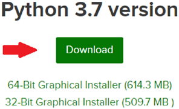
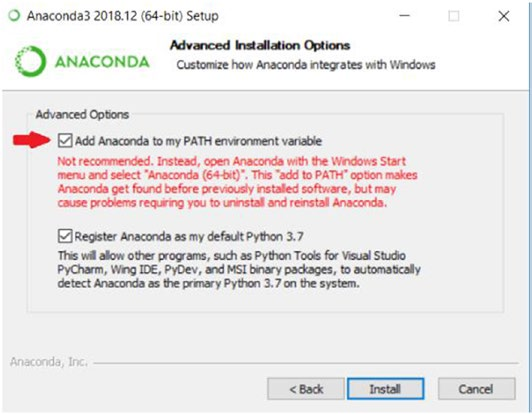

## 周二：设置Anaconda和Python
今天我们将安装本课程所需的软件。在本书中，我们将使用名为**Anaconda**的软件平台、名为**Jupyter Notebook**的**集成开发环境(IDE)**以及Python语言本身。严格来说，这本书使用的Python版本为Python 3，然而，有时你可能会看到我提到Python2和Python3之间的细微差别。好的，下面让我们先下载这些软件并安装它们，然后我将介绍它们各自是什么东东。

### 跨平台开发
Python几乎适用于所有当下主要的操作系统，这使它成为了一种跨平台的语言。这意味着你可以在一个操作系统上编写Python代码，而与使用与你完全不同机器的人一起工作。如果两台机器都安装了Python，它们应该都能运行该程序。

### 在Windows下安装Anaconda和Python
大多数苹果OS X系统和和Linux系统已经预先安装了Python语言。然而，你仍然需要下载Anaconda。对于Windows用户，Python通常需要手动安装，但你安装Anaconda的时候，会一起安装Python。推荐使用以下步骤正确安装：
1. 打开浏览器，输入www.anaconda.com/distribution/。
2. 单击标题中的download按钮(参见图1-1)。

**图1-1** Anaconda下载界面

3. 进入下一页后，请确保在顶部的标题中选择了正确的操作系统。点击对应的按钮（如图1-2所示）。

**图1-2** 选择操作系统

4. 接下来，选择并单击Python 3.7(或更新版本)的download按钮(参见图1-3)。

**图1-3** 选择Python3.x版本

5. 这一步仅**针对Windows用户**。当你下载好安装程序后，运行它。直到到达图1-4所示的页面前，你可以使用所有默认值，在图1-4界面，确保你点击了“**Add Anaconda to my PATH environment variables**”选项。这样我们就可以通过终端访问Anaconda了。

**图1-4** Add to Path（添加到路径）

6. 对于所有选项(除了针对Windows用户的步骤5之外)，使用默认设置。然后点击“安装”按钮，从而完成Anaconda的安装。

### Anaconda是什么？

Anaconda是一款Python和R发行版软件。它的目标是“开箱即用”地提供你使用Python所需的一切。它的主要用途在数据分析和数据科学领域。当然它也是一个极好的学习工具。下载时，它将同时安装以下内容：
-  Python语言的核心和一些常用的库
-  Jupyter Notebook
-  Anaconda自带的包管理器

这些只是Anaconda众多功能中的一小部分。然我我们将在整本书中使用这些功能。这个列表中最主要的特性是Python语言和包含Python可以访问的包。我们首先要理解库（library）的概念，库指的是由另一个开发人员预先编写的代码，您可以根据自己的需要使用。关于第二个特性Jupyter Notebook，我们将在下一节中讨论。最后，Anaconda有一种为我们管理环境的方法。这是一个复杂的话题，我们将在后面的几周进行讨论。

### Jupyter Notebook是什么？
Jupyter Notebook是一个开放源码的**集成开发环境(IDE)**，它允许你创建和共享包含实时代码、公式、可视化和叙述性文本的文档。对我们来说，本质上它就是我们的笔记本，我们将在那里一起编写代码。如果您不熟悉IDE，那么你只需要理解它们是供开发人员编写代码的工具即可。可以把它们看作是艺术家的画布。您可以在IDE中编写代码片段，而不需要对Python有很多了解。我们会在周四的课上看到更多关于Jupyter Notebook的内容。

----

在今天的课上，我们安装了Anaconda, Python和Jupyter笔记本。明天，我们将学习使用终端作用和使用。

----
